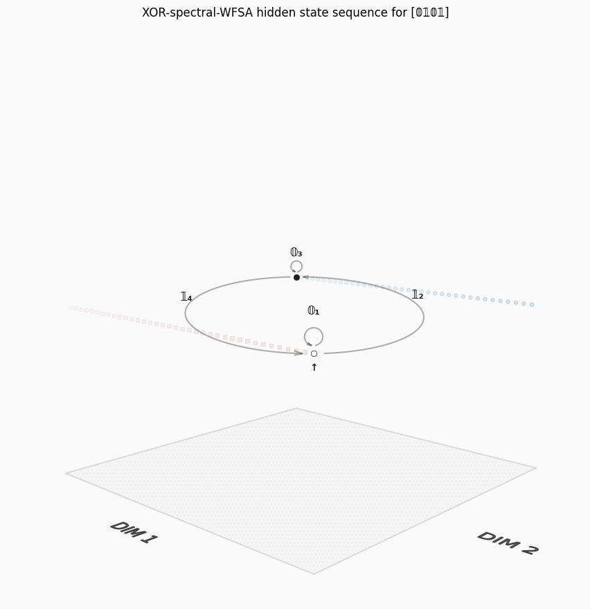
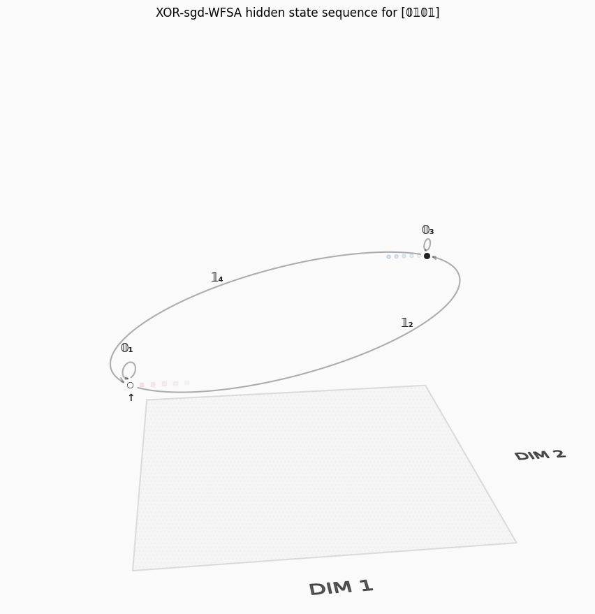
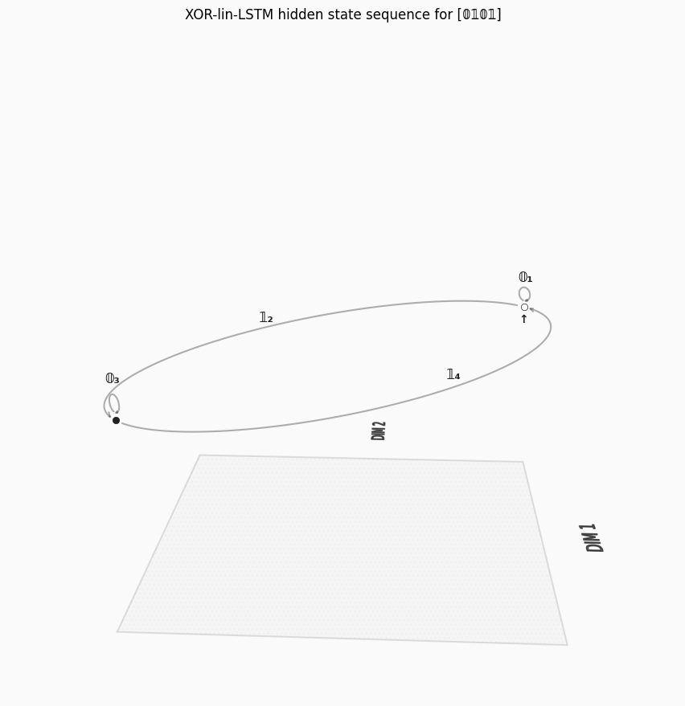
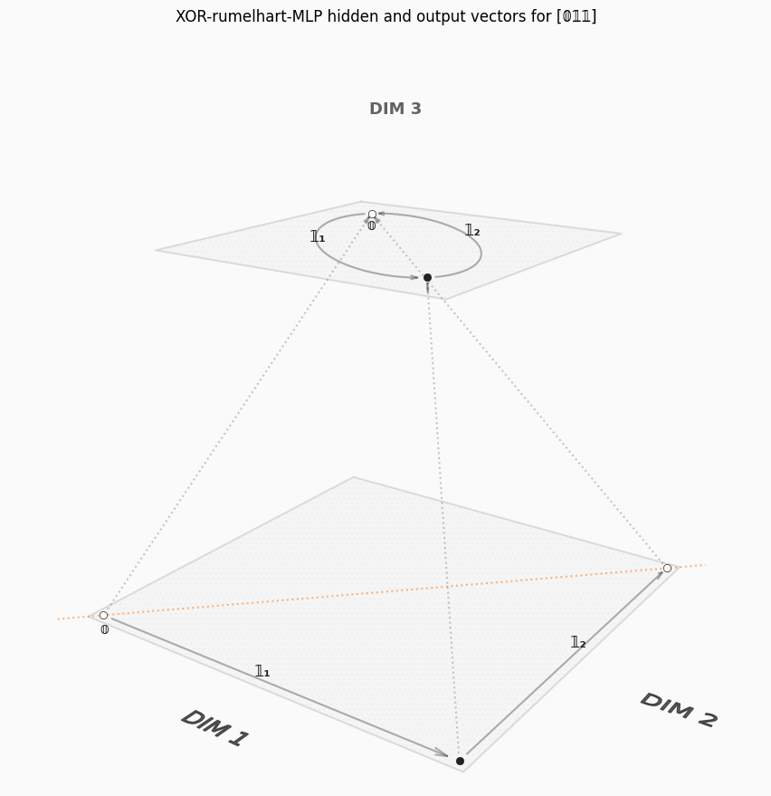
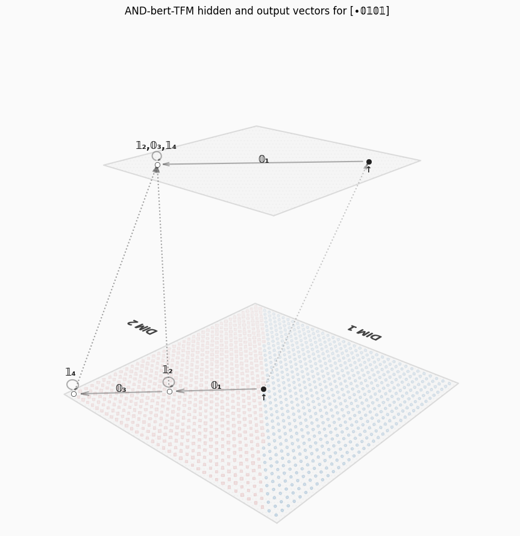

# AIS

This code accompanies the paper: [Llarena, J., _"Automata in Space: Formal Language Theory meets Neural Computation"_, 2024.](https://josellarena.github.io/assets/doc/ais-paper-v1.pdf)

<div style="display: grid; grid-template-columns: repeat(3, 1fr);">









</div>

## Installation

```shell
$ git clone git@github.com:JoseLlarena/ais.git
$ cd ais
$ python3 -m venv venv 
$ source venv/bin/activate
$ pip install -r requirements.txt
```

## Testing

```shell
$ pip install -r requirements-test.txt
$ pytest --cov=ais unittests/*.py --cov-report=term --cov-report=html && xdg-open htmlcov/index.html 
```

## Documentation

In-code.

## Changelog

Check the [Changelog](https://github.com/JoseLlarena/ais/blob/master/CHANGELOG.md) for fixes and enhancements in each version.

## License

Copyright Jose Llarena 2024-2025.

Distributed under the terms of the [MIT](https://github.com/JoseLlarena/ais/blob/master/LICENSE) license, ais is free 
and open source software.